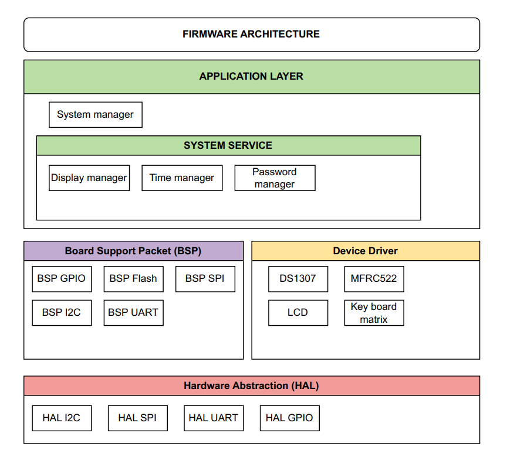
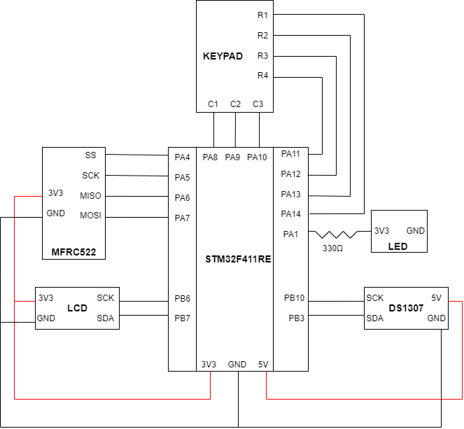
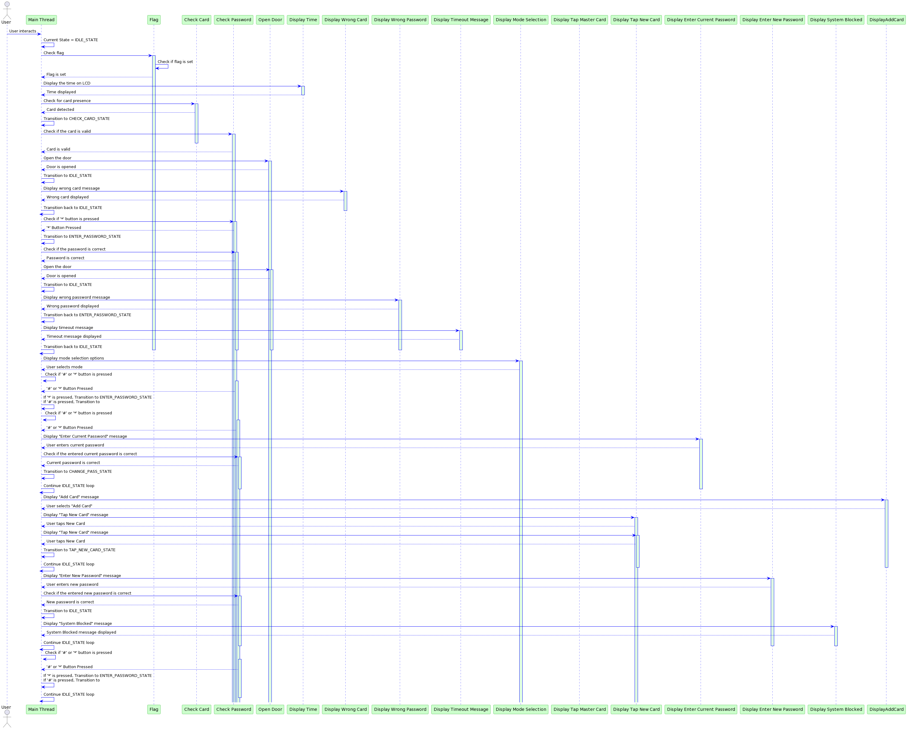

# SMART DOOR

## Table of Contents
- [SMART DOOR](#smart-door)
  - [Table of Contents](#table-of-contents)
  - [Feature](#feature)
  - [Modules](#modules)
  - [Block Diagram](#block-diagram)
  - [Schematic](#schematic)
  - [Sequence Diagram](#sequence-diagram)
  - [References](#references)

---
## Feature

- Unlocking by password (keypad).
- Unlocking via NFC-supported phone or NFC card (MFRC522).
- Wrong password 3 times --> block 60s (can't insert password)
- Use LCD to display status of door and the current time.
- Use sensor to detect door is close. (optional)
- Password change capability (via keypad or master NFC card).
    - Example:
        - Keypad: Press # to enter password change mode, enter the old password first, then enter the new password, and press * to save.
        - Master NFC card: Similarly, press # to enter password change mode, tap the master NFC card, then enter the new password, and finally press * to save.
- Can add multiple NFC cards for open door.
- Ability to retrieve door access history (displaying timestamps of door openings/closings) for a specified period (e.g., within 3 days) via a computer (UART).

---
(In a practical expansion, an app on a phone could be used to access the history of openings/closings, current door status, as well as to grant door access to another NFC card and revoke access rights for that card.)

---

## Modules
| Module Name                 | Quantity |
|-----------------------------|----------|
| STM32F4                     | 1        |
| Keypad  3x4                 | 1        |
| NFC-supported Phone/Card    | 1        |
| LCD16*2                     | 1        |
| Module I2C                  | 1        |
| DS1307                      | 1        |
| MXRC522                     | 1        |
| CP2102                      | 1        |
| LED                         | 1        |

---

## Block Diagram 

---

## Schematic

**Miss: use uart to connect PC**

---

## Sequence Diagram

---

## References
- [STM32f4 datasheet](https://www.st.com/resource/en/datasheet/stm32f411ce.pdf)
- [MFRC522 datasheet](https://www.elecrow.com/download/MFRC522%20Datasheet.pdf)
- [DS1307 datasheet](https://www.analog.com/media/en/technical-documentation/data-sheets/DS1307.pdf)
